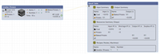

# Detrav Recipe Calculator

**Detrav Recipe Calculator** is a tool designed to streamline complex crafting calculations by providing a structured, visual, and customizable approach. It guides users through all necessary steps to accurately plan and manage resources across various crafting tiers. Perfect for gamers, modders, and developers working on resource management, Detrav Recipe Calculator supports desktop platforms including **Windows**, **Linux**, and **macOS**.

## Screenshots

[](screenshots/screen01.png)
[](screenshots/screen02.png)
[](screenshots/screen03.png)
[](screenshots/screen04.png)

## Key Features

1. **Recipe Creation and Customization**
   - Add and configure recipes with ease.
   - Adjust details for each recipe, ensuring all requirements align accurately.

2. **Resource Management**
   - Set up and manage resources essential to crafting, enabling accurate resource allocation.

3. **Visual Node-Based Editor**
   - Build and manage a crafting flow through an intuitive, node-based editor.
   - Track detailed statistics for each node, including total resource requirements, resulting outputs, and any excess or surplus resources.

4. **Advanced Crafting Calculations**
   - Use mathematical expressions for tier-based adjustments. For example, define scaling for Tier 1 and Tier 2 resources; simply input expressions like `value * tier` to dynamically calculate resource quantities on the graph.

5. **Color and Icon Customization**
   - Assign custom colors to nodes, resources, and connectors for easier visual distinction.
   - Choose from a library of in-game icons to personalize recipes and resources or add custom ones.

6. **Undo/Redo Support**
   - Full undo and redo functionality to ensure changes can be easily modified or reverted.

7. **Save and Load Projects**
   - Save crafting calculations and load them when needed, making it simple to resume complex projects.

## Future Development

Unfortunately, I don't have time to do support, but if I see a notification from github I will try to help, if you suddenly wrote, and I don't answer, most likely I am swamped with work and I don't have time to check the issue.


## How It Works

The calculator is broken down into four main stages:

1. **Add Recipes**
   - Define the initial recipes for your crafting process. Each recipe can be added with its respective details and configurations.

2. **Verify and Configure Recipes**
   - Review and fine-tune each recipe, ensuring all values, inputs, and outputs are correct and adjusted to your needs.

3. **Configure Resources**
   - Set up the resources required for your recipes, including quantities and other relevant properties.

4. **Build the Crafting Graph**
   - Use the visual editor to create a node-based graph of your crafting workflow. The graph provides a comprehensive view of your resource requirements and surplus, including a summary of total quantities and any excess materials.

5. **What tables are obtained**
   - `Input Summary` - the table shows the resources required to run the current scheme. They must be supplied through the pipeline in your game (job).
   - `Output Summary` - the table shows the resulting resources if all the necessary starting resources are provided.
   - `Recipes (Nodes, Machines)` - required machines (recipes) and a list of their settings.
   - `Resources Summary (Steps)` - the table contains all stages and description of all resources, in the Input and Output columns the actual amount of necessary resources is recorded, in the Shortage column the shortage of resources for full capacity is recorded, in the Surplus column the surplus of resources is recorded, which will remain or accumulate.

## Installation

To install and use Detrav Recipe Calculator, follow these steps:

1. Download the latest release from [Releases](link-to-release).
2. Follow platform-specific instructions for **Windows**, **Linux**, or **macOS**.
3. Launch the application and start building your first crafting project!

## Uninstallation

Delete the folder where the executable file was located, and also delete the folder with the settings in the directory `%APPDATA%/DetravRecipeCalculator`.

## Summary

Detrav Recipe Calculator is designed to simplify and elevate the process of crafting planning, providing a high degree of customization and control. Whether you’re managing resources for a game or organizing complex production workflows, Detrav Recipe Calculator has you covered.


## Icons and Assets

- **Game Icons**: Icons sourced from [game-icons.net](https://game-icons.net) are available under the **Creative Commons Attribution 3.0 License**. This means you are free to use and modify them, as long as you provide appropriate attribution.

- **App Icons**: Icons sourced from [icons8.com](https://icons8.com) are available under the **Icons8 License**. You can use these icons for free in your application, provided that you include a link to Icons8 in your README or provide appropriate credit.

Thank you to these resources for providing high-quality icons that enhance the usability and aesthetics of Detrav Recipe Calculator!

## ToDo

Not plans.

## Changelog

Simple changelog, read from top to bottom.

```
Version 0.1
-----------

+ Initial release.

Version 0.2
---------------

* Removed icon pack from the repository.
+ Added prompt to download the icon pack when opening the icon selection window.
+ Added download prompt localization.
+ Added format description to color tooltip: #rgb, #argb, #rrggbb, #aarrggbb.
+ Added ability to paste icon from clipboard.
+ Added color preview for background image, foreground image, and connection color.
+ Added color filter for icons.
+ Added 3px corner radius for icons.
+ Added icon preview to listbox.

Version 0.3
---------------
 
+ Added prototype of node graph editor.
+ Added node preview in the middle column with clickable functionality, allowing future calculation previews.
+ Added icons for tier switching.
+ Added functionality to adjust the number of crafts (machines).
+ Added colors for connectors.
+ Added connection lines with support for resource colors.
+ Added ability to delete connection lines.
+ Added resource icons on nodes.
+ Added basic resource calculation and display.
+ Added graph state serialization.
+ Added ability to copy and paste nodes.
* Modified node pasting mechanics: pasted nodes are now selected by default.
+ Added common editing shortcuts: undo, redo, cut, copy, delete, paste.
* Moved shortcuts to a separate menu, as they were not frequently used in the context menu.
+ Added undo and redo functionality for the graph editor.
+ Added save and load functionality for the graph editor model.
+ Added graph editor prototype.
+ Added localization support to the graph editor.

Version 0.4
---------------

+ Added time unit switching (ticks (Minecraft), seconds, minutes, hours, days, weeks, months (30 days), years (365 days)).
+ Added short resource name display for pins and output/statistics tables.
* Implemented resource renaming for graph models.
+ Added error flag for deleted resources.
+ Added warning flag when resource quantity is insufficient for continuous operation.
- Fixed an issue where undo/redo incorrectly saved the initial state during node graph editing.
+ Added expression parser and implemented mathematical calculations.
- Fixed time calculation issue, now time is automatically recalculated when the time mode is switched.
* Changed node parameters, now custom parameters can be set and used in the editor.
* Switched localization to invariant, now decimal separator is always a dot, not a comma in some languages.

Version 0.5
---------------

+ Added "Total Node" with four output tables. Tables can be toggled on or off. Usability is still under review, but they are structured similarly to tables I previously created in Excel, so I kept this layout.
+ Added rendering (export) of completed graph (pipeline) to a PNG file.
+ Added project templates for new project creation.
+ Added scripts for publishing.
+ Added screenshots.

Version 0.6
---------------
* Revised calculation approach: it’s no longer possible to set the number of machines or nodes manually. The calculator now determines the required resources and the parallel crafting needed.
- Fixed calculation errors.
* Removed the "Number" variable; to limit load, an intermediate recipe should now be added.
* Updated output table: now shows input and output for each resource, with an added "Total" column. Negative values indicate resource consumption or deficiency, while positive values indicate surplus.
- Discontinued NativeAOT compilation; now using a standard .NET application. This increased file size from 20MB to 40MB per operating system.

Version 0.7
- Fixed error where result table requests did not remove old requests before adding a new one.
- Fixed a bug with PNG export rendering.
* Updated algorithm for the input/output total table.
+ Added feature to save table visibility settings to a file, allowing restoration upon reopening the graph editor.
* Replaced line connections with Bezier curve connections.
- Fixed a bug where an empty variable name caused parsing errors.
+ Added support for splitting variables by commas, in addition to spaces.
* Pins with unknown types are now auto-converted to specified types; connecting unknown pins to each other is no longer allowed.
+ Added split pins, allowing multi-connection lines from a single pin.
- Fixed a bug where viewport movement caused focus loss; a partial fix has been applied, though the issue may still occur in some cases.
```

